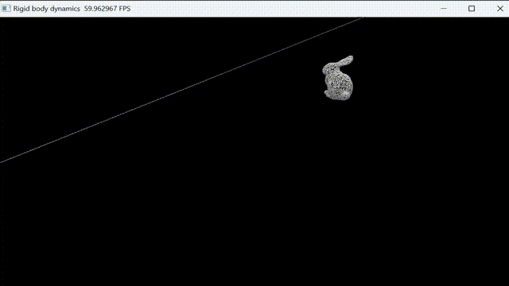
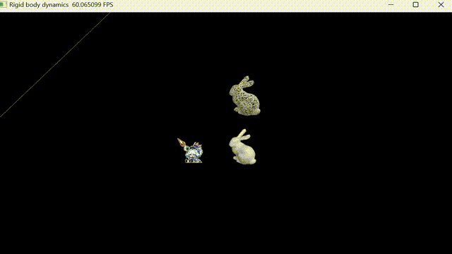

# Rigid body simulation

This is the code for the homework of rigid body simulation in [Games103](https://games-cn.org/games103/). 

This code is written in python and [taichi](https://github.com/taichi-dev/taichi) language.

## How to run

Type the following code in your terminal:

```
python single_object.py
```

or

```bash
python two_objects.py
```

Make sure you have successfully installed taichi:

```bash
pip install taichi
```

## Results

### Single object



### Two objects



SDF is used as the collision detection method. The SDF is generated by the *mesh_to_sdf* library and discretized onto a grid. During simulation, the value and gradient of SDF are obtained by cubic interpolation.

